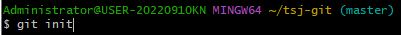
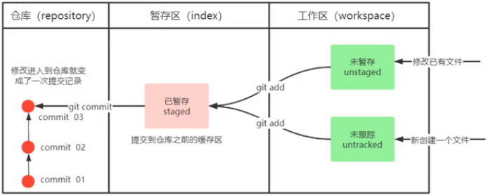
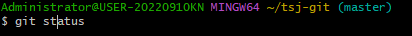
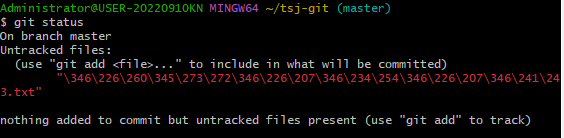
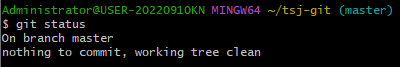
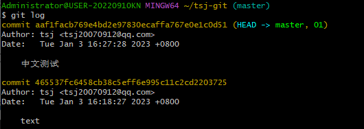
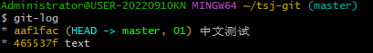

##### 创建git仓库
 在当前目录下创建一个git仓库
##### 常用命令 
"git add 接文件名" 将文件提交到暂存区 （费手的） "git add ." 将全部文件提交到暂存区（好用的）
"git commit -m "你为这次改动写的注释" " 将暂存区的文件提交到仓库
（此表通俗易懂言简意赅）

查看文件状态

红色代表这个文件还处于工作区未缓存

无红色代表工作区已经没有文件了

查看上传记录

这个简洁点我喜欢！